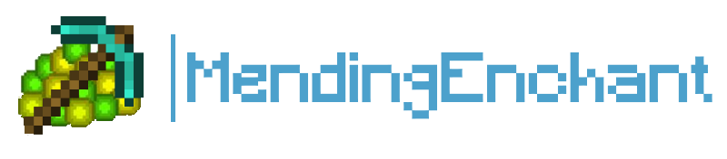

# MendingEnchant Documentation

  
MendingEnchant adds a configurable chance to obtain Mending from the enchanting table and from fishing, with world and item filters, custom permission tiers, localization, and a pity system.

{ .home-logo }

### Compatibility

  
  
  
  

[Get Started](installation.md){ .md-button .md-button--primary }
[Download](download.md){ .md-button }
[Configuration](configuration.md){ .md-button }

## Community

- [GitHub repository](https://github.com/stellionix/MendingEnchant)
- [CurseForge page](https://www.curseforge.com/minecraft/bukkit-plugins/mendingenchant)
- [BukkitDev page](https://dev.bukkit.org/projects/mendingenchant)
- [bStats page](https://bstats.org/plugin/bukkit/MendingEnchant/16292)
